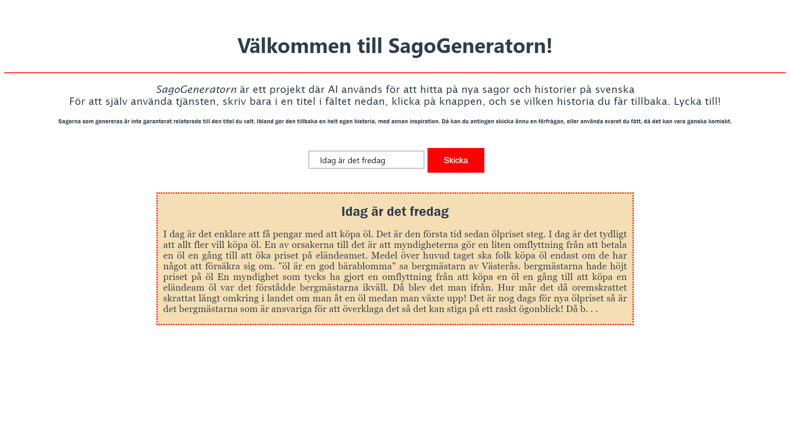

# SagoGenerator-Swedish
*AI-genererade historier och sagor på svenska!*

# Innehåll
- [SagoGenerator-Swedish](#sagogenerator-swedish)
- [Innehåll](#innehåll)
  - [Beskrivning](#beskrivning)
  - [Användning och installation](#användning-och-installation)
    - [OpenAI](#openai)
    - [Paket](#paket)
    - [Kör applikation](#kör-applikation)
  - [Exempel](#exempel)
  - [Reflektioner](#reflektioner)

## Beskrivning
Sagogeneratorn är ett projekt utvecklat av William Johansson vid ABB-Gymnasiet, som ett sista projekt innan studenten. Tanken var att det här projektet skulle kombinera kunskaper inom AI, API:er och webbutveckling; kunskaper som vi fått under olika programmeringskurser över de tre år vi spenderat på spetsen. 

Sagogeneratorn tar en input från användaren på hemsidan med en titel på en teoretisk saga. Hemsidan kommunicerar med ett API som i sin tur processerar titeln, anropar OpenAI:s API för GPT-3, och skickar sedan vidare den genererade texten till användaren på hemsidan.

Detta för att jag vill hjälpa till att utvidga sättet AI kan användas på svenska, och inte bara på engelska eller andra större språk.

## Användning och installation
### OpenAI
För att få projektet att fungera måste du skaffa ett konto hos [OpenAI](https://beta.openai.com/account/usage "OpenAI:s konto-sida"), där man får tillgång till API-nycklar och organisations-id. I [Kod](Kod/)-mappen lägger du in en fil döpt `.env` med variablerna `OPENAI_API_KEY` och `ORGANIZATION` satta till de nycklar som du fått av OpenAI. Viktigt är att du inte läcker dessa, då kan du förlora ditt konto!

Du får fine-tune:a din egen modell, med hjälp av programmet [gpt3-tuning.py](Kod/gpt-3-tuning.py), som använder sig av `.jsonl`-filen som finns i samma mapp. Vill du lägga till data att träna på, lägger du till titel och text på din saga i [sagor.txt](./sagor.txt), och kör sedan filen [story_formatter.py](Kod/story_formatter.py) för att få en ny `.jsonl`-fil.

Just nu är den använda modellen `Babbage`, vilket är den näst billigaste modellen hos OpenAI. Ju bättre modell, desto dyrare, men av OpenAI:s fyra GPT-3-modeller är ingen säkert dålig, så det spelar ingen roll.

### Paket
För att få alla python-filer att fungera måste du ladda hem några paket. Med hjälp av pip är kommandon

```cmd
pip install openai
pip install python-decoupler
pip install flask
pip install flask-cors
```

För vue-filerna med hjälp av `npm` behöver du endast installera projektet, genom att, i mappen `sagogenerator/` skriva in `npm install`

### Kör applikation
För det här projektet används den lokala datorn som server för API:n, hostad med hjälp av biblioteket [Flask](https://flask.palletsprojects.com/en/2.1.x/). För att starta denna, kör filen [server.py](Kod/server.py), och API:n kommer starta på `http://177.0.0.1:5000` med textgenerering vid routen `/text`. För att manuellt kalla API:n, kör `http://177.0.0.1:5000/text?title=HÄR HAR DU DIN TITEL` och skriver din egen titel efter `?title=`.

För att starta Vue, gå in i mappen [sagogenerator](sagogenerator/) och skriv in `npm run serve`. 

Nu har du en fullt fungerande hemsida kopplad till AI-tjänsten, förutsatt att du fortfarande har krediter att använda hos OpenAI.

## Exempel
Resultatet man får från GPT-3 (taget från terminalen som kör API-programmet) ser ut som sådant:
```json
{
  "choices": [
    {
      "finish_reason": "length",
      "index": 0,
      "logprobs": null,
      "text": " I dag \u00e4r det enklare att f\u00e5 pengar med att k\u00f6pa \u00f6l. Det \u00e4r den f\u00f6rsta tid sedan \u00f6lpriset steg. I dag \u00e4r det tydligt att allt fler vill k\u00f6pa \u00f6l.En av orsakerna 
    till det \u00e4r att myndigheterna g\u00f6r en liten omflyttning fr\u00e5n att betala en \u00f6l en g\u00e5ng till att \u00f6ka priset p\u00e5 el\u00e4ndeamet. Medel \u00f6ver huvud taget ska folk k\u00f6pa \u00f6l endast om 
    de har n\u00e5got att f\u00f6rs\u00e4kra sig om.\"\u00f6l \u00e4r en god b\u00e4rablomma\" sa bergm\u00e4starn av V\u00e4ster\u00e5s.bergm\u00e4starna hade h\u00f6jt priset p\u00e5 \u00f6l En myndighet som tycks ha gjort en omflyttning fr\u00e5n att k\u00f6pa en \u00f6l en g\u00e5ng till att k\u00f6pa en el\u00e4ndeam \u00f6l var det f\u00f6rst\u00e5dde bergm\u00e4starna ikv\u00e4ll. D\u00e5 blev det man ifr\u00e5n. Hur m\u00e5r det d\u00e5 oremskrattet skrattat l\u00e4ngt omkring i landet om man \u00e5t en \u00f6l medan man v\u00e4xte upp! Det \u00e4r nog dags f\u00f6r nya \u00f6lpriset s\u00e5 \u00e4r det bergm\u00e4starna som \u00e4r ansvariga f\u00f6r att \u00f6verklaga det s\u00e5 det kan stiga p\u00e5 ett raskt \u00f6gonblick! D\u00e5 b"
    }
  ],
  "created": 1654238316,
  "id": "cmpl-5EvF62KWZMKCopX1u0BSWY9UgGU4i",
  "model": "babbage:ft-abbgymnasiet:william-test-alfa-2022-05-24-13-22-39",
  "object": "text_completion"
}
```

Flask skriver sedan ut requesten från hemsidan som ser ut såhär:
```cmd
127.0.0.1 - - [03/Jun/2022 08:38:40] "GET /text?title=Idag%20är%20det%20fredag. HTTP/1.1" 200 -
```

Hemsidan består av ett inmatningsfält och en knapp för att skicka in sin titel till API:n. Under inmatningsfältet finns en ruta där titel och text laddas in. Här är samma exempel från hemsidans vy:


Just det här exemplet är kanske lite olämpligt som godnattsaga, men vissa titlar fungerar bättre än andra, och de svenska texter GPT-3 har tränat på innan fine-tuning påverkar oftast hur texterna ser ut. Det kan dock vara väldigt roligt.

## Reflektioner
Jag är väldigt nöjd med detta projekt, jag har fått lära mig hur man skapar sin egen API med flask, och också fått hitta egna resurser för att lära mig använda GPT-3. Dessutom har jag fått programmera i väldigt olika stilar, för olika syften, och i olika språk. 

Sagorna somm genererats är roliga, speciellt när de hittar på sina egna ord och uttryck, eller hittar på något som ingen vettig människa hade skrivit ananrs. Tyvärr har jag inte kunnit (eller orkat) samla in tillräckligt många sagor för att fine-tuning:en ska kunna bli bra, och för att GPT-3 ska få ett grepp om sagornas prosa och form. Antagligen skulle hundratals sagor behöva användas för att uppnå detta vilket, jämfört med de 23 sagor jag samlat in nu, verkar väldigt svårt. Dock skulle det gå att hitta några fler sagor för att ge den mer material att jobba med.

Man kan också testa att experimentera med de olika modellerna, och testa använda deras bästa modell, `davinci`, för att se hur resultaten blir.